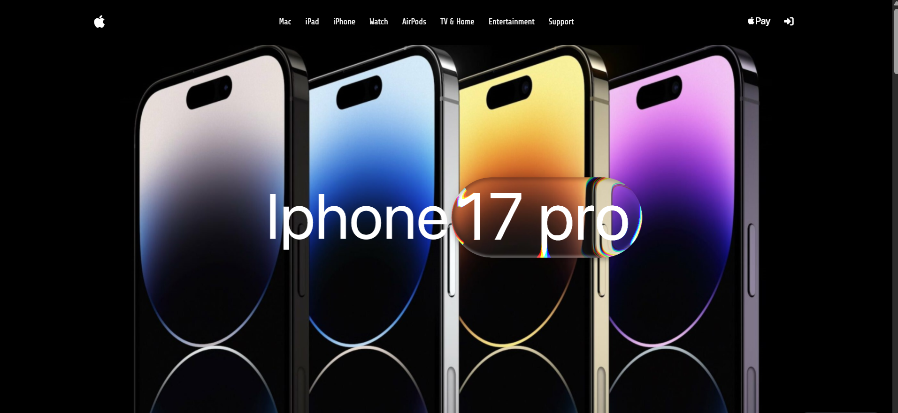

# Apple Website Clone (Frontend)



## Description
This is a **frontend clone of the Apple website** built using **Angular** and Tailwind. The project replicates the look and feel of Apple's official site, including navigation, product sections, and responsive design.

This project is primarily for **learning and portfolio purposes**, focusing on:  
- Angular components and modular architecture  
- Routing and navigation  
- Responsive web design  
- CSS styling and layout  

## Features
- **Homepage** with banner and product highlights  
- **Navigation bar** similar to Apple's official site  
- **Product sections** for iPhone, Mac, iPad, and Accessories  
- **Responsive design** for desktop and mobile  
- Smooth **scrolling effects**  
- **Reusable Angular components** for cards, sections, and navbar  

## Technologies Used
- **Angular** (latest version)  
- **HTML5 & CSS3**  
- **TypeScript**  
- **Angular Router** for navigation  
- Optional: **Tailwind CSS** or **SCSS** for styling  

## Project Setup

### 1. Clone the repository
```bash

git clone https://github.com/AnkitSinha0/Apple-Website-Clone.git

cd Apple-Website-Clone

### Install dependencies

npm install

##  Run the project

ng serve